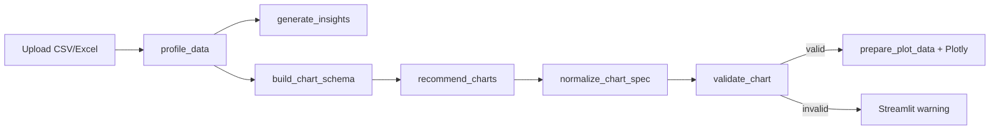

# Executive Insights AI Agent

An AI-powered business intelligence agent that analyzes datasets, identifies trends, detects risks, and generates executive-level insights from CSV and Excel files. Link to the tool -> https://ai-executive-insights.streamlit.app/

The goal of this project is to help decision-makers quickly understand business performance without manually exploring raw data.

## Overview

Executive Insights AI Agent combines data analytics with Large Language Models (LLMs) to transform business data into actionable insights.

After you upload a dataset, the app:

- Profiles the data (shape, types, missing values)
- Generates an executive analysis (insights, risks, trends, summary)
- Recommends up to three charts with explanations
- Normalizes and validates each chart spec, aggregates data when needed, and renders interactive Plotly charts

## Features

### Data upload

- CSV (`.csv`)
- Excel (`.xlsx`)

### Automated data profiling

- Row and column counts
- Data type detection
- Missing value analysis

### AI-powered insights

Powered by the OpenAI Chat Completions API (`agents/insight_agent.py`):

- Key business insights
- Risk detection
- Trend analysis
- Executive summary

### AI-recommended visualisations

Powered by the OpenAI Responses API with structured output (`tools/chart_recommender.py`):

- LLM suggests three executive-level charts from enriched column metadata (types, cardinality, ID detection)
- Each recommendation includes title, chart type, axes, optional aggregation, and rationale
- **Normalize** — fixes common mistakes (e.g. using `Emp ID` as a metric for a headcount trend → monthly `count`)
- **Validate** — blocks identifier columns as metrics, excessive pie/bar categories, and invalid axis combinations
- **Render** — aggregates data (monthly/quarterly counts, sum, mean) before Plotly; caps crowded categories

Supported chart types: `line`, `bar`, `pie`, `scatter`.

## Chart pipeline



| Step | Module | What it does |
|------|--------|----------------|
| Schema | `chart_schema.py` | Per-column metadata: `nunique`, numeric/datetime flags, `looks_like_id` |
| Recommend | `chart_recommender.py` | LLM returns `ChartRecommendations` (structured JSON) |
| Normalize | `chart_validator.py` | Auto-correct ID-on-axis and trend-without-aggregation specs |
| Validate | `chart_validator.py` | Semantic rules; returns an error message if skipped |
| Prepare | `charts_renderer.py` | Group-by-period counts, sum/mean, top-N categories |
| Display | `app.py` | `st.plotly_chart` or `st.warning` |

### ChartSpec fields

| Field | Description |
|-------|-------------|
| `title` | Executive-facing chart title |
| `chart_type` | `line`, `bar`, `pie`, or `scatter` |
| `x` | Column for categories or time axis |
| `y` | Numeric metric (optional when `aggregation` is `count`) |
| `reason` | One-sentence rationale shown in the UI |
| `aggregation` | `none`, `count`, `sum`, or `mean` |
| `time_freq` | For datetime `x`: `D`, `W`, `ME`, `QE`, or `YE` (pandas period aliases) |

**Example:** A “headcount trend by join date” chart should use `chart_type: line`, `x: Date of Join`, `aggregation: count`, `time_freq: ME` — not employee IDs on the y-axis.

## Architecture

## Project structure

```
ai-executive-insights-agent/
├── app.py                      # Streamlit entry point
├── agents/
│   └── insight_agent.py        # Executive insights via Chat Completions
├── tools/
│   ├── data_loader.py          # Dataset profiling
│   ├── charts_model.py         # Pydantic ChartSpec / ChartRecommendations
│   ├── chart_schema.py         # Column metadata for the LLM
│   ├── chart_recommender.py    # LLM chart recommendations
│   ├── chart_validator.py      # normalize_chart_spec + validate_chart
│   └── charts_renderer.py      # Aggregation + Plotly rendering
├── .env.example
├── pyproject.toml
├── requirements.txt
├── uv.lock
└── README.md
```

## Technology stack

| Area | Tools |
|------|--------|
| Language | Python 3.14+ |
| Data | Pandas, NumPy |
| AI | OpenAI API (Chat Completions + Responses with structured parsing) |
| Models | Pydantic (`ChartSpec`, `ChartRecommendations`) |
| UI | Streamlit |
| Charts | Plotly Express |
| Config | python-dotenv |
| Packaging | [uv](https://docs.astral.sh/uv/) (`pyproject.toml`, `uv.lock`) |

## Installation

### Clone the repository

```bash
git clone https://github.com/savi-jus/ai-executive-insights-agent.git
cd ai-executive-insights-agent
```

### Option A: uv (recommended)

Requires [uv](https://docs.astral.sh/uv/) installed.

```bash
uv sync
```

### Option B: pip + virtual environment

**Windows**

```powershell
python -m venv .venv
.venv\Scripts\activate
pip install -r requirements.txt
```

**macOS / Linux**

```bash
python3 -m venv .venv
source .venv/bin/activate
pip install -r requirements.txt
```

Regenerate `requirements.txt` after dependency changes:

```bash
uv export --no-dev --no-hashes -o requirements.txt
```

## Environment variables

Copy the example file and add your keys:

```bash
cp .env.example .env
```

| Variable | Required | Description |
|----------|----------|-------------|
| `OPENAI_API_KEY` | Yes | Your OpenAI API key |
| `INSIGHTS_MODEL` | Yes | Model for executive insights (e.g. `gpt-4o-mini`) |
| `CHARTING_MODEL` | Yes | Model for structured chart specs (e.g. `gpt-4o-mini` or `gpt-4o`) |
| `DATABASE_URL` | No | Reserved for future use |
| `DEBUG` | No | Reserved for future use |

Example `.env`:

```env
OPENAI_API_KEY=sk-your-key-here
INSIGHTS_MODEL=gpt-4o-mini
CHARTING_MODEL=gpt-4o-mini
```

Never commit `.env` to version control (it is listed in `.gitignore`).

Use a model that supports OpenAI **Responses** structured parsing for `CHARTING_MODEL`. Stronger models tend to produce better chart specs on complex schemas.

## Running the application

With your virtual environment active:

```bash
streamlit run app.py
```

Open [http://localhost:8501](http://localhost:8501) in your browser.

The UI uses a **light-themed dashboard** with sidebar upload and tabs: **Overview**, **Insights**, **Charts**, and **Data**. Theme settings live in `.streamlit/config.toml`.

Restart Streamlit after pulling code changes so layout and chart updates load.

## Example workflow

1. **Upload** a CSV or Excel file via the Streamlit file uploader.
2. **Preview** the first rows of the dataset.
3. **Profile** — row/column counts, dtypes, and missing values.
4. **Insights** — key findings, risks, trends, and an executive summary.
5. **Charts** — three recommendations with titles and rationale; each spec is normalized, validated, aggregated, and plotted. Invalid charts show a warning instead of a misleading graphic.

## Deployment (Streamlit Community Cloud)

1. Push the project to GitHub (`app.py`, `requirements.txt`, `agents/`, `tools/`). Do not push `.env`.
2. Sign in at [share.streamlit.io](https://share.streamlit.io) and create a **New app**.
3. Set **Main file path** to `app.py`.
4. Under **Secrets**:

```toml
OPENAI_API_KEY = "sk-your-key-here"
INSIGHTS_MODEL = "gpt-4o-mini"
CHARTING_MODEL = "gpt-4o-mini"
```

5. Deploy and test with a sample upload.

**Python version:** The project targets Python 3.14. If the host does not support it, set `requires-python` in `pyproject.toml` to e.g. `>=3.12`, run `uv lock`, re-export `requirements.txt`, and redeploy.

**Security:** There is no built-in authentication. Restrict access to your deployment URL when data is sensitive.

## Sample executive summary

> Revenue increased 12% quarter-over-quarter, driven primarily by enterprise customers in New South Wales.
>
> Customer churn increased in March and April, particularly among small business customers.
>
> **Recommendation:** Investigate customer retention initiatives for the SMB segment and expand successful enterprise acquisition strategies.

## Potential use cases

- Executive reporting
- Business intelligence
- Sales performance analysis
- Customer analytics
- Financial reporting
- Operational insights
- Survey analysis
- Strategic planning
